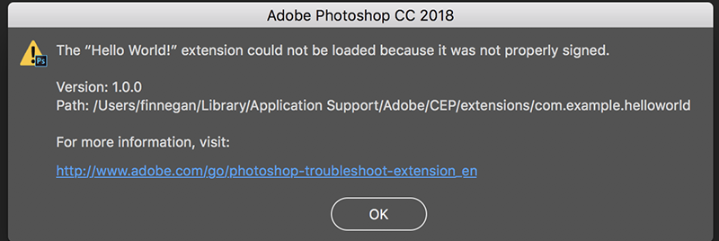

# A Guide to Debugging Your Adobe Panel

This guide will walk you through the necessary steps to debug the client-side code for your panel.

<!-- doctoc command config: -->
<!-- $ doctoc ./readme.md --title "## Contents" --entryprefix 1. --gitlab --maxlevel 3 -->

<!-- START doctoc generated TOC please keep comment here to allow auto update -->
<!-- DON'T EDIT THIS SECTION, INSTEAD RE-RUN doctoc TO UPDATE -->
## Contents

- [Prerequisites](#prerequisites)
- [Set the Debug Mode](#set-the-debug-mode)
- [Troubleshooting “Your Panel Name” extension could not be loaded because it was not properly signed.](#troubleshooting-your-panel-name-extension-could-not-be-loaded-because-it-was-not-properly-signed)
- [Create a `.debug` File](#create-a-debug-file)
- [Write Contents for the `.debug` File](#write-contents-for-the-debug-file)
  - [Note:](#note)
- [Debugging in Chrome](#debugging-in-chrome)
- [Troubleshooting a blank Chrome console](#troubleshooting-a-blank-chrome-console)
- [Next Steps](#next-steps)
- [Other Resources](#other-resources)

<!-- END doctoc generated TOC please keep comment here to allow auto update -->

## Prerequisites
This guide will assume that you have installed the following software and completed all steps in the following guide:

1. The latest version of Chrome.
1. Read the [Getting Started with CEP Extenstions Guide](https://github.com/Adobe-CEP/Getting-Started-guides/blob/master/readme.md) 


## Set the Debug Mode
First, set the following Adobe preference to prevent your host application (Photoshop, InDesign, etc.) from throwing alerts about unsigned extensions. The [HTML Extension Cookbook](https://github.com/Adobe-CEP/CEP-Resources/blob/master/CEP_8.x/Documentation/CEP%208.0%20HTML%20Extension%20Cookbook.md) section on [Debugging Unsigned Extensions](https://github.com/Adobe-CEP/CEP-Resources/blob/master/CEP_8.x/Documentation/CEP%208.0%20HTML%20Extension%20Cookbook.md#debugging-unsigned-extensions) explains this process:
> Windows: Openregedit > HKEY_CURRENT_USER/Software/Adobe/CSXS.8, then add a new entry `PlayerDebugMode` of type “`string`” with the value of “`1`”.
> Mac: In the Terminal, type: `defaults write com.adobe.CSXS.8 PlayerDebugMode 1`


*On Macs, Terminal is located in (Applications > Utilities > Terminal).*

*In Windows, Regedit is located in (C:\Windows\regedit). You can access it using CMD, too.*

## Troubleshooting “Your Panel Name” ...was not properly signed.

The change above is invisible if performed correctly. Otherwise, you’ll get the following error about unsigned extensions:

**The “Your Panel Name” extension could not be loaded because it was not properly signed.**

Don’t worry about [signing your extensions](https://github.com/Adobe-CEP/CEP-Resources/blob/master/CEP_8.x/Documentation/CEP%208.0%20HTML%20Extension%20Cookbook.md#signing-extensions) until you’re ready to distribute to users.

If you’ve set the debug mode and are still getting the error above, [try killing the **cfprefsd** process](https://github.com/Adobe-CEP/CEP-Resources/blob/master/CEP_8.x/Documentation/CEP%208.0%20HTML%20Extension%20Cookbook.md#special-notes-for-mac-109-and-higher), or check out this [recent thread about troubleshooting debug mode](https://forums.adobe.com/thread/2444749) in the Adobe forums.


## Create a `.debug` File

Next, create a `.debug` file. The .debug file needs to be at the top level of your panel’s folder.


The `.debug` file must be a hidden file in order to work.

In MacOS, the easiest way to do this is to either use the code editing tool of your choice (like Sublime Text or Brackets) to create the file, or use the touch command in the Terminal. Since the .debug file is hidden, you’ll only see it if you have hidden files toggled on, or, as of MacOS Sierra, you can use the shortcut `Command Shift +` to see hidden files.

If you’re using Windows 10, you can name a text file `.debug` and the `.` at the front will make it hidden. To see your hidden files, you can expand your view options in a File Explorer window and check the Hidden Files box.

*How to see your hidden files in Windows 10.*

## Write Contents for the `.debug` File

The `.debug` file must include the following elements:

```html
    <ExtensionList>
        <Extension Id="com.example.helloworld">
           <HostList>

               /* This host application will be Photoshop */
               <Host Name="PHXS" Port="8088"/>

            </HostList>
        </Extension>
    </ExtensionList>    
```


### Notes on the `.debug` file contents
1. The same Extension ID above must match the Extenstion ID in your `manifest.xml` file (see [our Getting Started Guide](https://github.com/Adobe-CEP/Getting-Started-guides/blob/master/readme.md) for more information.

1. PHXS is the host name for Photoshop. [The full list of host application ports is available in the CEP Cookbook](https://github.com/Adobe-CEP/CEP-Resources/blob/master/CEP_8.x/Documentation/CEP%208.0%20HTML%20Extension%20Cookbook.md).

1. You may choose any port number.


## Debugging in Chrome
Open Chrome and go to `http://localhost:8088/` or whichever port you set in your `.debug` file in the previous section.


*CEF Remote Debugging in Chrome*

If your panel is working, you’ll see a link you can click on, as seen in the image above. The link will take you to a mostly blank page. 

Click on “View → Developer → JavaScript Console”. If there are errors or console messages, you will see them in the JavaScript console.

*The JavaScript Console in Chrome*

In the example below, the `console.log()` message is “I can’t believe you clicked!”. The message originates from the `index.html` file:

```html
    <html>
    <head>
        <title>Hello World!</title>
    </head>
    <body> 

        /* Create a panel with the title “Hello World!” with a button labeled “Click this!” */
        <h1>Hello World!</h1>
        <button id="myButton">Click this!</button>

        /* The button will listen for a click event, and then display a message in the console. */
        <script type="text/javascript">
        document.getElementById('myButton')
            .addEventListener('click', function(){
                console.log(**"I can't believe you clicked!"**);
            })
        </script>

    </body>
    </html>
```


## Troubleshooting a blank Chrome console
If your debug console in Chrome appears blank, check your `.debug` file one more time or try following [the steps on this Adobe forum thread](https://forums.adobe.com/thread/2426224).

## Next Steps

Now that you've seen the basics, check out these guides and samples that walk you through some common intermediate and advanced topics in CEP:

- [Exporting files from the host app](Exporting%20files%20from%20the%20host%20app)
- [Network requests and responses with Fetch](Network%20requests%20and%20responses%20with%20Fetch)


## Other Resources
- [CEP Cookbook](https://github.com/Adobe-CEP/CEP-Resources/blob/master/CEP_8.x/Documentation/CEP%208.0%20HTML%20Extension%20Cookbook.md)
- [CEP Samples repo](https://github.com/Adobe-CEP/Samples)
- [Adobe Photoshop Reference Doc](https://www.adobe.com/devnet/photoshop/scripting.html)
- [Adobe Illustrator Reference Doc](https://wwwimages2.adobe.com/content/dam/acom/en/devnet/illustrator/pdf/Illustrator_JavaScript_Scripting_Reference_2017.pdf)
- [InDesign Reference Guide](https://wwwimages2.adobe.com/content/dam/acom/en/devnet/indesign/sdk/cs6/scripting/InDesign_ScriptingGuide_JS_JP.pdf)